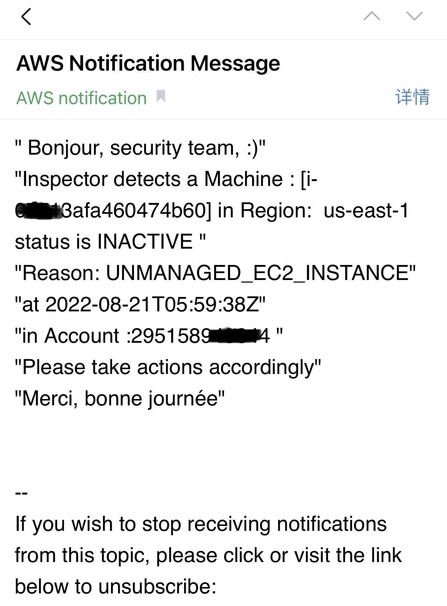

# Launch EC2 in certain regions
## Preventive control
Use SCP from the account and OU level
https://docs.aws.amazon.com/organizations/latest/userguide/orgs_manage_policies_scps_examples_general.html

Use IAM condition key for single user group or user, as below blog shows
https://aws.amazon.com/blogs/security/easier-way-to-control-access-to-aws-regions-using-iam-policies/

## Detective control
How to detect the launch of ec2 in non-approved region while we can not totally prevent everything?
### Cloudtrail
Deploy an eventbridge rule in each non-approved region to monitor the API call ec2:runinstance, then send alert to email by using SNS
### Inspector
Deploy an eventbridge rule in each non-approved region to monitor inspector coverage alert,then send alert to email by using SNS.

Download the [cloudformation template](inspector2-coverage-alert.yml) and create a stack in each non-approved region by either CLI or Cloudformation Stacksets for multiple accounts in an Organizations.
#### CLI command
```
stackname=myteststack
regions=($(aws ec2 describe-regions --query 'Regions[*].RegionName' --output text))
email=11111@qq.com
```
```
for region in $regions; do
aws cloudformation create-stack --stack-name $stackname --template-body file://Arch1-template.yaml \
--parameters  \
ParameterKey=EmailAddress,ParameterValue=$email \
--capabilities CAPABILITY_IAM \
--region=$region
echo $region
done

```
Result will be:

